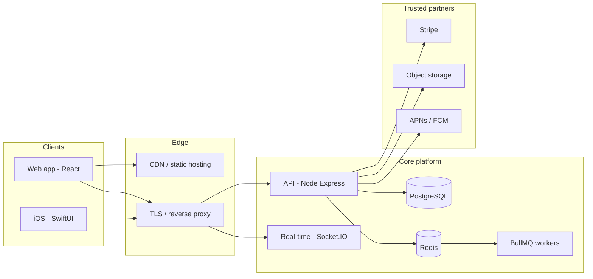

# CampusCuts — Technology overview

*For investors and partners. Engineering detail lives in [`TECH_STACK.md`](./TECH_STACK.md).*

---

## One sentence

CampusCuts is a **multi-surface marketplace** (web + native iOS) on a **modern TypeScript stack**, with a **Node.js API**, **PostgreSQL** data layer, **Stripe** for payments and payouts, and **real-time** messaging—designed to scale with standard cloud patterns (containers, object storage, Redis-backed jobs).

---

## Platform at a glance

| Dimension | Choice | Why it matters |
|-----------|--------|----------------|
| **Languages** | TypeScript (API + web), Swift (iOS) | Shared patterns across services; native mobile performance and UX. |
| **API** | Node.js, Express | Mature ecosystem, fast iteration, straightforward hiring and DevOps. |
| **Data** | PostgreSQL + Prisma | Reliable relational model for bookings, users, and marketplace logic; schema migrations under control. |
| **Payments** | Stripe (including Connect) | Industry-standard card rails, compliance-aware primitives, barber payout flows. |
| **Real-time** | Socket.IO | Live updates for messaging and time-sensitive booking/payment events. |
| **Jobs & cache** | Redis, BullMQ | Background work (payouts, notifications) without blocking the API; horizontal scaling path. |
| **Web client** | React 19, Vite, Tailwind | Fast builds, responsive UI, component-driven product velocity. |
| **Mobile** | SwiftUI (iOS 17+), shared Swift package | First-class App Store experience; shared logic in `CampusCutsModule`. |
| **Media** | AWS S3 (typical deployment) | Durable, CDN-friendly image and asset delivery. |
| **Shipping** | Docker images (backend + web) | Repeatable deploys across staging and production. |

---

## Architecture (conceptual)

---

## Product surfaces

### Consumer & barber web

- **React 19** with **Vite** for production builds (static assets, easy CDN deployment).
- **TanStack Query** and **Zustand** for server state and UI state.
- **Stripe.js** for secure card capture without card data touching our servers beyond Stripe’s tokens.

### Native iOS

- **SwiftUI** application plus a **shared Swift package** for networking patterns and reuse.
- **Socket.IO** client for parity with web real-time features.

---

## Backend & reliability

- **Express** HTTP API with structured validation, rate limiting, and security headers (industry-standard middleware).
- **JWT** session model; **WebAuthn** support for modern passwordless options where enabled.
- **Winston** logging and **node-cron** for scheduled tasks.
- **End-to-end tests** with **Playwright** for critical flows in CI-capable form.

---

## Payments & money movement

- **Stripe** for payment intents, Connect accounts for providers, and webhook-driven reconciliation—reducing custom PCI scope compared to handling raw card data.
- Optional **on-chain / USDC** paths and **Sui** SDK usage in the codebase for blockchain-adjacent features; fiat today runs through Stripe as the primary card rail (see `TECH_STACK.md` for library-level detail).

---

## Security & compliance posture (technical)

- Secrets and keys are **environment-scoped** (not committed); see [`API_KEYS.md`](./API_KEYS.md) for a categorized reference.
- **HTTPS** termination and **CORS** configuration appropriate to split web/API hosting.
- **Helmet** and rate limits on the API reduce common attack surface.

*This is a technical summary, not legal or PCI advice.*

---

## Why this stack is investor-friendly

1. **Proven components** — PostgreSQL, Stripe, Redis, and React reduce execution risk versus exotic or single-vendor stacks.
2. **Clear scaling levers** — API instances, read replicas, Redis clusters, and worker pools are well-understood scale paths.
3. **Native mobile** — SwiftUI signals serious mobile commitment (retention, notifications, App Store distribution).
4. **TypeScript end-to-end** (web + API) — Faster refactors, fewer production bugs, easier team expansion.

---

## Documentation map

| Audience | Document |
|----------|----------|
| Engineering (libraries, paths, versions) | [`TECH_STACK.md`](./TECH_STACK.md) |
| Secrets & integrations | [`API_KEYS.md`](./API_KEYS.md) |
| Product / storage / ops depth | Root markdown (e.g. `SYSTEM_STORAGE.md`, `PAGE_FLOWS.md`) as applicable |

---

*Figures are architectural and indicative of typical deployment; exact hosting and regions are environment-specific.*
