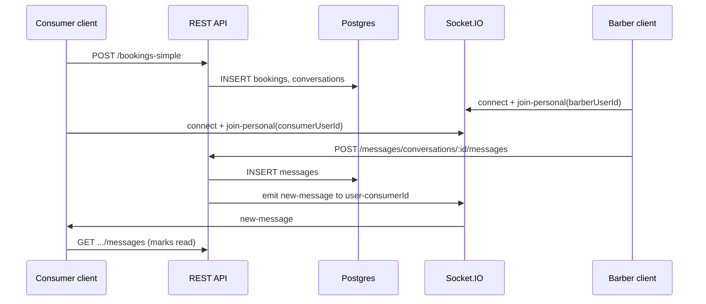

# CampusCuts: Consumer–Barber Messaging

This document describes how messaging works between consumers and barbers in the CampusCuts codebase: data model, APIs, real-time delivery, UI rules, and related flows.

---

## 1. Product model: booking-centric threads

Consumer ↔ barber chat is built around **one row in `conversations`** per logical booking thread, not arbitrary direct messages.

- Each conversation links **two user IDs** (`user1_id`, `user2_id`) and usually carries **booking context**: `booking_id`, `service_name`, `service_price`, `scheduled_time`, `location`, `notes`, `barber_name`, `consumer_name`, `booking_status` (e.g. `pending` / `accepted` in the database).
- The **list endpoint** only returns conversations where **`is_active = true`**. When a booking moves into certain payment or completion flows, the backend may set **`conversations.is_active = false`**, which **hides** the thread from the inbox even though historical messages remain.

**API mount paths:** `/api/v1/messages` and `/api/messages` (see `backend/src/index.ts`).

---

## 2. How a conversation is created

### 2.1 Automatically with booking creation

When a consumer confirms a booking via **`POST /api/v1/bookings-simple`**, the server **inserts or upserts** a `conversations` row tied to **`booking_id`** (`backend/src/routes/booking-simple.routes.ts`). That seeds the thread with service, time, location, and notes.

### 2.2 From the client after booking

**`BookingPaymentPage`** may call **`messageService.startBookingConversation(barberUserId, { bookingId, … })`**, which maps to **`POST /api/v1/messages/conversations`** with the same booking context:

- Web client: `web-app/src/services/message.service.ts`
- Route handler: `backend/src/routes/message.routes.ts`

### 2.3 From the Messages UI (navigation state)

**`MessagesPage`** can create a thread when opened with **`location.state`** containing `startConversation`, `otherUserId`, `bookingId`, service fields, etc. It calls **`messageService.createConversation`** (same POST).

### 2.4 Deduplication in `startConversation` (backend)

In **`backend/src/services/message.service.ts` → `startConversation`**:

- If **`scheduledTime`** is provided, the service looks for an existing row for the **same pair of users** and **same `scheduled_time`**.
- If one exists, is **`is_active`**, and **`booking_status === 'pending'`**, it **returns that conversation** instead of creating another.
- If the prior thread was **rejected** or **cancelled**, a **new** conversation may be created.

New rows set **`booking_status`** to **`pending`** at insert (lowercase in DB for this column).

---

## 3. REST API (consumer ↔ barber)

All routes require authentication: **`Authorization: Bearer <accessToken>`**.

| Action | Method | Path |
|--------|--------|------|
| List threads | GET | `/messages/conversations` |
| Create thread | POST | `/messages/conversations` |
| Load messages | GET | `/messages/conversations/:conversationId/messages` |
| Send message | POST | `/messages/conversations/:conversationId/messages` |
| Mark read | PUT | `/messages/conversations/:conversationId/read` |
| Delete thread | DELETE | `/messages/conversations/:conversationId` |
| Unread total (badge) | GET | `/messages/unread-count` |

**Notes:**

- **POST `/messages/conversations`** accepts **camelCase or snake_case** (e.g. `otherUserId` / `other_user_id`, `bookingId` / `booking_id`).
- **GET `/messages/conversations`** sets **`Cache-Control: no-store`** so lists stay fresh.
- **GET `.../messages`** also **marks the other party’s messages as read** for the current user.
- There is **no** dedicated **GET `/messages/conversations/:id`** (without `/messages`) in `message.routes.ts`; the typical pattern is list + messages.

**Send body (POST `.../messages`):**

- `content` (required for text)
- `messageType` (optional; default `text`)
- `mediaUrl` (optional; used with image uploads)

---

## 4. Message send pipeline: database → Socket.IO → recipient

1. **`sendMessage`** in **`message.service.ts`** verifies the sender belongs to the conversation and that **`is_active = true`**, then **inserts** into **`messages`** and updates **`conversations.last_message_at`**.
2. **Push + in-app notification:** `pushNotificationService.sendMessageNotification` and **`notificationService.saveNotification`** with type **`new_message`**.
3. **Email:** Role-aware templates (`sendConsumerNewMessageEmail`, `sendBarberNewMessageFromConsumerEmail`, etc.). Active **barber** detection uses the **`barbers`** table (`isActive = true`), not only `users.role`.
4. **Realtime:** **`message.routes.ts`** loads the conversation, derives the **recipient** user id, and emits:

   ```text
   io.to(`user-${recipientId}`).emit('new-message', messagePayload)
   ```

   The recipient must have joined Socket.IO room **`user-<theirUserId>`**.

---

## 5. WebSocket client (web app)

**File:** `web-app/src/services/socket.service.ts`

- Connects to **`WS_URL`** (from `web-app/src/config/constants.ts`).
- Passes **`auth: { token }`** (JWT from localStorage).
- On **`connect`**, reads **`user.id`** from stored user JSON and emits **`join-personal`** with that id so the server adds the socket to **`user-${userId}`**.

The server handler in `backend/src/index.ts` types `userId` as `number`, but **UUID string** user ids are used in production; room names are still string templates `user-${userId}`.

**Client helpers** such as `joinConversation` / `sendMessage` (socket `join-conversation`, `send-message`) exist on the client; **persistence and broadcast** for normal chat are implemented via **HTTP POST** in `message.routes.ts`, which then emits **`new-message`**.

---

## 6. Messages UI: consumer vs barber

**File:** `web-app/src/pages/MessagesPage.tsx`  
**Routes:** URL contains **`/consumer/messages`** vs **`/barber/messages`** → **`isBarberView`**.

### 6.1 Pending booking: who can type first?

The UI uses **`selectedConversation.booking?.status === 'pending'`** (lowercase from API shaping).

| Role | Behavior |
|------|----------|
| **Barber** | May **always** send while pending. Copy indicates they can discuss details **before accepting**. |
| **Consumer** | **Cannot** send until **at least one message** in the thread exists from someone **other than** the consumer (interpreted as “barber reached out”). Until then: **“Waiting for barber to respond to your request.”** |

When status is **not** `pending`, **both** sides get the normal composer (subject to backend **`is_active`** and membership checks).

**Important:** This rule is enforced in the **web UI only**. The API does **not** reject a consumer’s first message on a pending thread. Native or other clients should replicate this policy if product behavior should match the web.

### 6.2 Sending and receiving

- **Send:** `handleSendMessage` performs an **optimistic** append, then **`POST .../conversations/:id/messages`**, then reconciles with the response and refreshes the conversation list.
- **Receive:** Listener on **`new-message`**. If the payload’s **`conversation_id`** matches the open thread, the message is appended and **`markConversationAsRead`** is called.

### 6.3 Booking updates in chat

Socket event **`booking-update`** updates local conversation/booking state or **removes** a conversation when a booking is **cancelled**.

### 6.4 Images

**`messageService.uploadChatImage`** uploads to **`POST /upload/chat-image`**; send with **`message_type: 'image'`** and **`media_url`** as applicable.

---

## 7. Unread counts and read state

- **Per-thread unread:** Computed in the conversations list query: messages where **`sender_id ≠ current user`** and **`is_read = false`**.
- **GET `/messages/unread-count`:** Returns a total for header badges (`{ success, data: { count } }` from the route).
- **GET `.../conversations/:id/messages`:** Bulk-updates **`is_read`** for the other party’s messages in that thread.

**State store:** `web-app/src/store/useMessageStore.ts` (handles multiple possible API response shapes).

---

## 8. Deleting a conversation

**DELETE `/messages/conversations/:conversationId`** (`message.routes.ts`):

- Resolves the other participant and may insert a **`booking_cancelled`** notification.
- Delegates to **`messageService.deleteConversation`**.

---

## 9. Related messaging (same subsystem, different product flows)

Also under **`/api/v1/messages`** (see `message.routes.ts` and `message.service.ts`):

| Flow | Purpose |
|------|--------|
| **Campus manager ↔ barber** | `POST /messages/cm-barber`, `GET /messages/cm-barber/conversations` — threads with **`booking_id IS NULL`**. |
| **Barber ↔ barber** | `GET /messages/barber-chats/barbers`, `POST /messages/barber-chats` — campus peer list and direct threads. |

These reuse **`conversations`** / **`messages`** and the same **`new-message`** emission pattern where applicable.

---

## 10. Sequence overview



---

## 11. Key source files

| Layer | Path |
|--------|------|
| HTTP routes | `backend/src/routes/message.routes.ts` |
| Domain logic | `backend/src/services/message.service.ts` |
| Socket.IO setup | `backend/src/index.ts` (`io.on('connection')`, `join-personal`) |
| Client API | `web-app/src/services/message.service.ts` |
| Client realtime | `web-app/src/services/socket.service.ts` |
| Chat UI | `web-app/src/pages/MessagesPage.tsx` |
| Message store | `web-app/src/store/useMessageStore.ts` |
| Booking + conversation seed | `backend/src/routes/booking-simple.routes.ts` |

---

## 12. Summary

Consumer–barber messaging is **booking-thread based**, stored in **`conversations`** and **`messages`**, with **JWT-authenticated REST** for list/send/read/delete and **Socket.IO `new-message`** to room **`user-{recipientId}`** after each successful send. **Push notifications, in-app notifications, and email** supplement realtime delivery. The web **Messages** page applies a **barber-first** rule while **`booking.status === 'pending'`**; both sides chat freely once the booking is no longer pending, until the conversation is **deactivated** or **deleted**.
